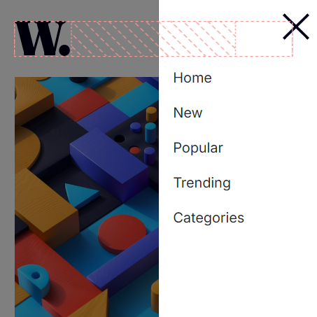

# News homepage

## Descrição:

Site web simples destinado a criar uma página inicial onde você pode navegar pelo menu.

## Tecnologias Utilizadas

- **HTML**: Estrutura do site.
- **CSS**: Estilo visual.
- **Bootstrap**: Framework para design responsivo.

## Funcionalidades

- Navegação simples e opção para abri menu.
- Design responsivo e acessível.

## Tamanho da tela 1440px

## Tamanho da tela 375px

## Licença

Este projeto é licenciado sob a [MIT License](LICENSE).

## Contato

- **Seu Nome**: williamaraujodossantos.com
- **GitHub**: [Meu GitHub](https://github.com/william3002)
